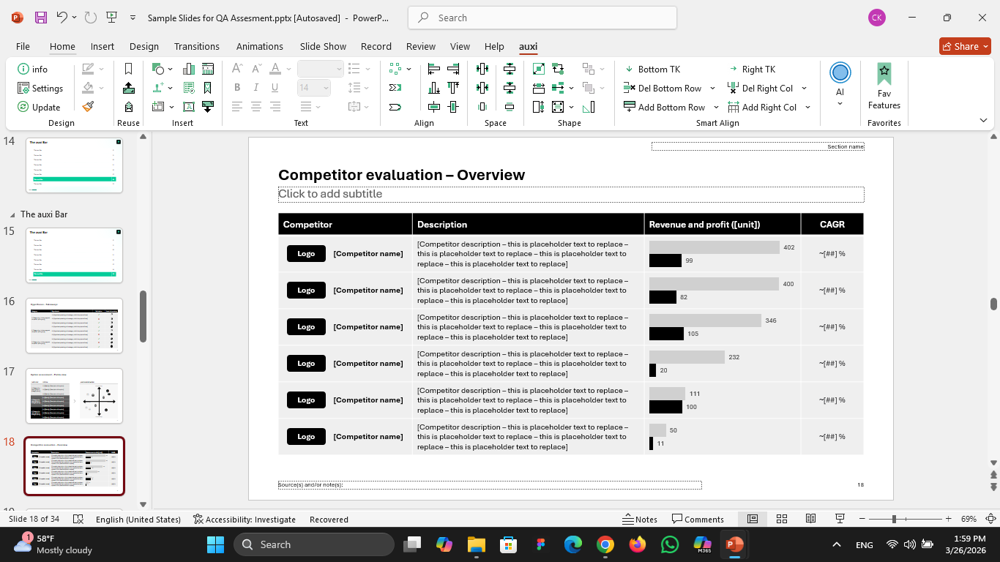
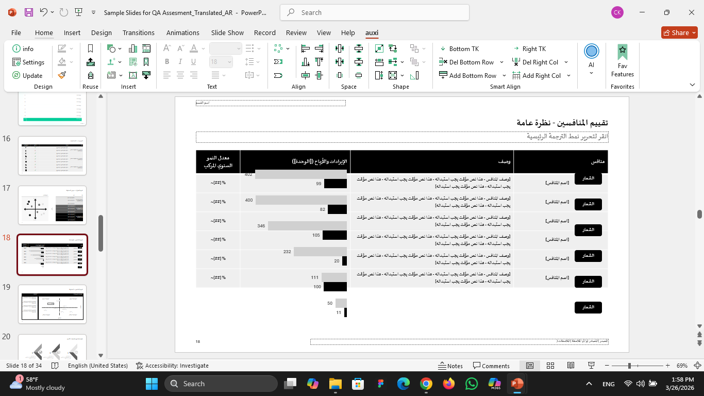

# QA Case Study – PowerPoint Add-in Testing

## Overview

This project showcases an exploratory testing effort conducted on a PowerPoint add-in designed to enhance presentation creation through features such as assets management, agenda automation, and translation.

The goal was to evaluate functionality, usability, performance, and consistency across core features.

---

## Testing Approach

I used an exploratory testing approach focused on real user workflows rather than predefined test cases.

### Areas Covered:

* Assets panel (templates and snippets)
* Agenda feature
* Translation feature

### Method:

* Simulated real-world usage scenarios
* Tested edge cases and uncommon interactions
* Compared behavior across similar features
* Observed performance and UI responsiveness

---

## Key Findings

### Critical Issue

**PowerPoint freezes when inserting Cloud/Team snippet**

* Causes complete application freeze
* Requires restart
* Reproducible multiple times

---

### High Impact Issue

**Table layout breaks after translation (English → Arabic)**

* Affects specific complex table types
* Simpler tables remain unaffected
* Likely related to RTL formatting handling

* Before translation:

After translation:

---

### Functional Issues

* Agenda does not sync with slide navigation until hover
* “Design and Divider Slides” button is not clickable
* Minimize button affects entire PowerPoint instead of auxi window

---

### Performance Issue

* Lag when scrolling through assets and templates
* Delayed hover previews

---

## Observations & Insights

### First Impressions

* Feature-rich and useful for professional presentations
* Some features lack clear entry points (e.g., Assets panel)
* Slight performance delays affect initial perception

---

### Inconsistency Identified

Different table types behave inconsistently during translation:

* Some maintain structure
* Others break layout

This suggests uneven handling of complex components.

---

### User Perspective

Under time pressure, the most frustrating issue would be the application freeze when inserting snippets, as it completely blocks workflow and risks losing progress.

---

### Edge Case Testing

Two non-obvious scenarios were tested in the Agenda feature:

1. Rapid reordering of agenda items to test synchronization stability
2. Editing items after reordering to verify correct mapping to slides

These scenarios simulate real-world usage where users frequently adjust content dynamically.

---

## Skills Demonstrated

* Exploratory Testing
* Bug Reporting & Documentation
* UX Analysis
* Edge Case Identification
* Test Prioritization

---

## Full Report

You can find the full detailed report here:
📄 [View Full Report](QA_Report.pdf)

---

## Disclaimer

This case study is based on a public assessment.
No confidential or proprietary information is included.
